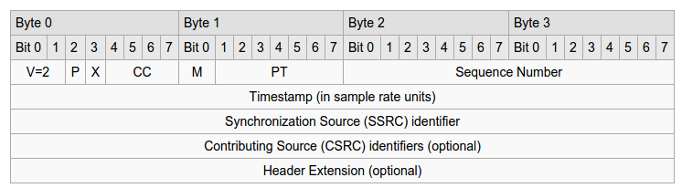

# Projektrahmen
Im Praktikum werden Sie einen Client und Server für Videostreaming unter Nutzung des Real-Time-Streaming-Protokolls [RTSP](http://www.ietf.org/rfc/rfc2326.txt) implementieren. Die eigentlichen Videodaten werden mittels Real-Time-Protokoll [RTP](http://www.ietf.org/rfc/rfc3550.txt) übertragen. Ein großer Teil der Funktionalität ist bereits als Quelltext vorhanden, so das RTSP-Protokoll im Server, das RTP-Handling im Client sowie die Videoanzeige.
Ihre Aufgabe besteht im Wesentlichen aus der Ergänzung der Quellcodes in den Punkten:
* RTSP-Protokoll im Client vervollständigen
* RTSP-Protokoll, Methoden DESCRIBE und OPTIONS im Server vervollständigen
* RTP-Protokoll, Header im Server setzen
* FEC in Client, Paketkorrektur implementierne

## 1. Java-Klassen
Das Projekt besteht aus folgenden Java-Klassen:

[Client](src/Client.java): Funktionalität des Clients mit Benutzerschnittstelle zum Senden der RTSP-Kommandosund Anzeige des Videos  
[Server](src/Server.java): Funktionalität des Servers zur Antwort auf die RTSP-Clientanfragen und Streaming des Videos  
[RTPpacket](src/RTPpacket.java): Funktionalität zur Unterstützung von RTP-Paketen  
[FECpacket](src/FECpacket.java): Erweiterung der RTP-Klasse mit FEC-Funktionalität  
[FecHandler](src/FecHandler.java): Unterstützung der Fehlerkorrektur mittels FEC  
[VideoReader](src/VideoReader.java): Einlesen einer MJPEG-Datei auf der Serverseite  
[JpegFrame](src/JpegFrame): Codierung/Decodierung von JPEG-Bildern gemäß RFC-2435

## 2. Programmstart
Der Start des Servers erfolgt mittels `java Server RTSP-Port`. Der Standard-RTSP-Port ist 554, Sie werden aber im Praktikum einen Port > 1024 nutzen. Der Start des Clients erfolgt mittels `java Client server_name server_port video_file`. Am Client können RTSP-Kommandos angefordert werden. 
Eine Kommunikation läuft in der Regel folgendermaßen ab:  
1. Client sendet DESCRIBE: Analyse der vorhandenen Streams und Parameter einer gewünschten Präsentation
2. Client sendet SETUP: Erzeugung der Session und der Transportparameter anhand der vorab ermittelten Parameter
3. Client sendet PLAY 
4. Client sendet u.U. PAUSE
5. Client sendet TEARDOWN: Terminierung der Session.
Der Server antwortet auf alle Clientrequests. Die Antwortcodes sind ähnlich zu HTTP. Der Code 200 bedeutet z.B. Erfolg. Die RTSP-Antwortcodes finden Sie in [RTSP](http://www.ietf.org/rfc/rfc2326.txt).

## 3. Client
Als ersten Schritt sollte das RTSP-Protokoll in den Handlern der Buttons des Benutzerinterfaces vervollständigt werden. Für die RTSP-Kommunikation mit dem Server wird der bereits geöffnete Socket verwendet. In jeden Request muss ein CSeq-Header eingefügt werden. Der Wert von CSeq erhöht sich bei jedem Senderequest.

### Setup
* Erzeugen eines Sockets für den Empfang der RTP-Pakete und setzen des Timeouts (5 ms)
* Senden des SETUP-Requests an den Server, Ergänzung des Transportheaders mit dem geöffneten RTP-Port.
* Einlesen der RTSP-Antwort vom Server und parsen des Sessionheaders für die Session-ID

### Play
* Senden des PLAY-Requests mit Sessionheader und Session-ID (kein Transportheader)
* Einlesen der RTSP-Antwort

### Pause
* Senden des PAUSE-Requests mit Sessionheader und Session-ID
* Einlesen der RTSP-Antwort

### Teardown
* Senden des TEARDOWN-Requests mit Sessionheader und Session-ID
* Einlesen der RTSP-Antwort

### Beispiel
Bitte beachten Sie, dass der im Praktikum verwendete RTSP-Parser im Client und Server nur eine Untermenge an möglichen Attributen unterstützt. Im Zweifelsfall schauen Sie bitte in die jeweilige Implementierung. 
Sie können sich an dem folgenden Beispiel orientieren (C-Client,S-Server). je nach Konfiguration Ihres Rechners müssen Sie unter Umständen mit FQDN arbeiten (\zb idefix.informatik.htw-dresden.de)
```
C: OPTIONS rtsp://idefix/htw.mjpeg RTSP/1.0
 : CSeq: 1

S: RTSP/1.0 200 OK
 : CSeq: 1
 : Public: DESCRIBE, SETUP, TEARDOWN, PLAY, PAUSE

C: SETUP rtsp://idefix/htw.mjpeg RTSP/1.0
 : CSeq: 2
 : Transport: RTP/UDP;unicast;client_port=25000-25001

S: RTSP/1.0 200 OK
 : CSeq: 2
 : Session: 123456

C: PLAY rtsp://idefix/htw.mjpeg RTSP/1.0
 : CSeq: 3
 : Session: 123456

S: RTSP/1.0 200 OK
 : CSeq: 3
 : Session: 123456

C: PAUSE rtsp://idefix/htw.mjpeg RTSP/1.0
 : CSeq: 4
 : Session: 123456

S: RTSP/1.0 200 OK
 : CSeq: 4
 : Session: 123456

C: TEARDOWN rtsp://htw.mjpeg RTSP/1.0
 : CSeq: 5
 : Session: 123456
```

### Zustände des Clients
Im RTSP-Protokoll hat jede Session einen bestimmten Zustand. Sie müssen den Zustand des Clients entsprechend aktualisieren.


## 4. Server
Auf Serverseite muss das Einbetten der Videodaten in die RTP-Pakete erfolgen. Die beinhaltet das Erzeugen des Paketes, Setzen der Headerfelder und setzen der Payload. Für Informationen zur Bitmanipulation in Java siehe **Vorlesungsfolien zu RTP**.
Im Beleg wird nur eine Quelle genutzt (CC=0), das Feld CSRC existiert also nicht. Die Länge des RTP-Headers beträgt demzufolge 12 Byte.

<!--    -->

```
    0                   1                   2                   3
    0 1 2 3 4 5 6 7 8 9 0 1 2 3 4 5 6 7 8 9 0 1 2 3 4 5 6 7 8 9 0 1
   +-+-+-+-+-+-+-+-+-+-+-+-+-+-+-+-+-+-+-+-+-+-+-+-+-+-+-+-+-+-+-+-+
   |V=2|P|X|  CC   |M|     PT      |       sequence number         |
   +-+-+-+-+-+-+-+-+-+-+-+-+-+-+-+-+-+-+-+-+-+-+-+-+-+-+-+-+-+-+-+-+
   |                           timestamp                           |
   +-+-+-+-+-+-+-+-+-+-+-+-+-+-+-+-+-+-+-+-+-+-+-+-+-+-+-+-+-+-+-+-+
   |           synchronization source (SSRC) identifier            |
   +=+=+=+=+=+=+=+=+=+=+=+=+=+=+=+=+=+=+=+=+=+=+=+=+=+=+=+=+=+=+=+=+
   |            contributing source (CSRC) identifiers             |
   |                             ....                              |
   +-+-+-+-+-+-+-+-+-+-+-+-+-+-+-+-+-+-+-+-+-+-+-+-+-+-+-+-+-+-+-+-+
```

## 5. Literatur

[1]: Kurose, Ross "Computernetzwerke", Pearson  
[2]: www.ietf.org/rfc/rfc2326.txt (RTSP)

