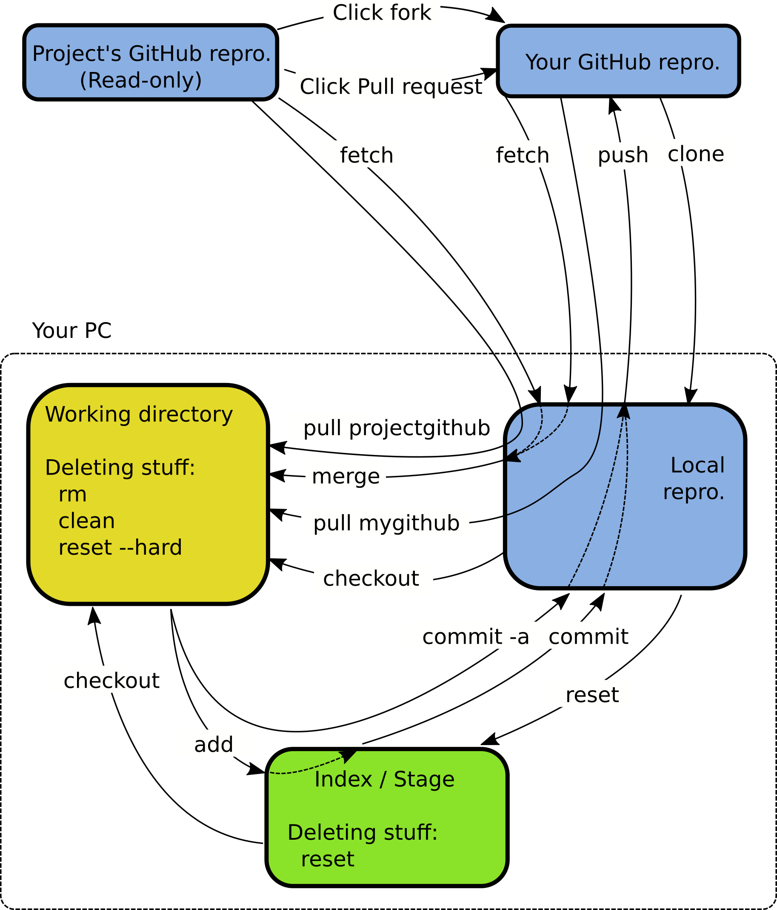

# Schritte zum eigenen Repository

## Eigenes Repository erstellen
Erzeugen Sie einen eigenen GitHub-Account falls Sie noch keinen haben. Senden Sie das Nutzerkennzeichen per E-Mail an den Modulverantwortlichen oder informieren Sie diesen im Praktikum. Nach dem Erhalt der Bestätigungs-E-Mail sind Sie Mitglied der GitHub-Organisation HTWDD-RN. Falls Sie die E-Email nicht erhalten, können Sie alternativ die Mitgliedschaft auf http://github.com/HTWDD-RN bestätigen.

Erzeugen Sie auf HTWDD-RN ein eigenes **privates** Repository mit einem Namen entsprechend Ihrer S-Nummer und des Modulkürzels (`yyy=[rn|it1|it2|sn|vs]`) in der Form `sXXXX-yyy-beleg` . Fügen Sie als Kommentar Ihren **Namen** hinzu, um die Zuordnung zu erleichtern. Dies können Sie auch nachträglich auf der Website des betreffenden Repositories tuen, wenn Sie beim Code-Tab den Edit-Button benutzen.

Den Namen des zu klonenden Repositories finden Sie auf der Vorlesungswebsite.

## Eigenes Repository mit Aufgaben-Repository verknüpfen
Repository lokal klonen  
`git clone https://github.com/HTWDD-RN/"Name des zu klonenden Repositories"`

Wechsel in das angelegte lokale Repository  
`cd "Name des Repositories"`

Umbenennen des Alias des originalen Repositories     
`git remote rename origin htw-upstream`

Anlegen der Verknüpfung (myrepo) mit dem eigenen entfernten Repository  
Syntax: `git remote add [alias] [url]`     
Beispiel: `git remote add myrepo https://github.com/HTWDD-RN/sxxxxx-yyy-beleg`

Aktualisierung des eigenen entfernten Repositories mit aktuellem Branch  
`git push myrepo`


## Arbeiten im eigenen Branch
Oft ist es sinnvoll, nicht im master-Branch zu arbeiten, sondern in einem eigenen Branch.
Dadurch kann der master-Branch immer mit dem upstream-Repository synchron gehalten werden.
Master steht hier für den Standard-Branch, dieser kann auch einen anderen Namen haben, z.B. WS-2019.

Erzeuge neuen Branch `beleg` und wechsle in diesen:  
`git checkout -b beleg`  
lade diesen ins eigene Repo. als Branch `beleg` hoch:  
`git push myrepo beleg`  
verknüpfe lokalen Branch mit entferntem Branch (Remote-Tracking-Branch):  
`git branch -u myrepo/beleg`

Testen lässt sich die korrekte Zuordnung mittels: `git remote -vv`
```
htw-upstream	https://nutzer@github.com/HTWDD-RN/RTSP-Streaming (fetch)
htw-upstream	https://nutzer@github.com/HTWDD-RN/RTSP-Streaming (push)
myrepo	        https://nutzer@github.com/HTWDD-RN/sXXXXX-yyy-beleg (fetch)
myrepo	        https://nutzer@github.com/HTWDD-RN/sXXXXX-yyy-beleg (push)
```

Mittels `git branch -vva` wird die Zuordnung der lokalen Branches zu den Remote-Branches angezeigt (der Marker * zeigt den aktiven Branch an):
```
* beleg  8b1e446 [myrepo/beleg]
  master 2eb7c88 [htw-upstream/master]
```

Aktualisierung des eigenen entfernten Repositories  
`git push myrepo beleg`  
Aktualisierung des master-Branches vom upstream-Repository  
`git fetch htw-upstream master:master`

## Grundlegende Schritte im lokalen und entfernten Repository

### Dateien für die Versionierung auswählen
Dateien im Arbeitsverzeichnis mit lokalem Repr. verknüpfen  
`git add [file]`  z.B. `git add *.java`

### Lokalen Commit erzeugen
alle Änderungen an den versionierten Dateien ins lokale Repr. übergeben  
`git commit -a`  oder  `git commit -a -m "kurze Angabe der Änderungen"`

### Lokales Repro mit entferntem Repro abgleichen
Änderungen des entfernten Repros ins lokale Repro übernehmen  
`git pull myrepo`  

lokale Änderungen des Repros ins entfernte Repro übernehmen  
`git push myrepo beleg`

## Integrieren der Änderungen des Upstream-Repositories
Falls aktualisierte Dateien im HTW-Repository bereitgestellt werden, können diese mit dem eigenen Repository zusammengeführt werden.

Änderungen des Upstream-Repros ins lokale Repro übernehmen:  
`git fetch htw-upstream master:master` 

Änderungen vom Upstream-Branch `master` im lokalen Branch `beleg` zusammenführen:
`git merge htw-upstream/master`  

Unter Umständen ist das Auflösen eines Merge-Konfliktes notwendig.
Mittels `git mergetool --tool=meld` können die gewünschten Änderungen komfortabel  ausgewählt werden.

## Grundlegende Befehle

### Status azeigen
* Anzeige aller neuen oder geänderten Dateien `git status`
* Anzeige der Änderungen `git diff`
* Anzeige der verknüpften entfernten Repros  `git remote -v`
* Anzeige der Branches  `git branch -vv`
* Anzeige der Versionshistorie des aktuellen Branches `git log`
* Anzeige der Versionshistorie einer Datei `git log --follow [file]`
* Anzeige der Metadaten eines Commits `git show [commit]`

### Dateihandling
Es ist günstiger das Dateihandling mittels Git-Befehlen vorzunehmen, dann werden Änderungen im Dateisystem gleich erkannt.
* Datei löschen `git rm [file]`
* Datei nur im Index löschen `git rm --cached [file]`
* Datei verschieben `git mv [file-orig] [file-renamed]`

### Branches
Für neue Features einer Software eignen sich am Besten ein neuer Branch.
* Neuen Branch erstellen `git branch [branch-name]`
* Branch auschecken `git checkout [branch-name]`
* Branch mit aktuellen Branch zusammenführen `git merge [branch]`
* Branch löschen `git branch -d [branch-name]`

### Rücknahme von Änderungen
* Datei im Arbeitsbereich auf Zustand im Repro zurücketzen `git checkout -- [file]`
* Rücknahme aller commits nach [commit] (Arbeitsbereich bleibt unverändert) `git reset [commit]`
* Rücknahme aller Änderungen und Wechsel zu ang. Commit `git reset --hard [commit]`

### Zwischenspeicher
Manchmal will man schnell an einem anderen Branch arbeiten aber die geänderten Dateien noch nicht commiten.
Dazu eignet sich der Zwischenspeicher.
* Temoräre Speicherung `git stash`
* Holen der letzen Speicherung `git stash pop`
* Anzeigen des Speichers `git stash list`

### Arbeitserleichterung
Die globale Konfigurationsdatei der ignorierten Dateien befindet sich in `~/.gitignore`.
Hier können alle unerwünschten Dateiendungen wie z.B. `*.class *.*~ *.out *.log bin/  tmp*` aufgelistet werden.

Die globale Konfiguration befindet sich in ~/.gitconfig  
* Konfiguration auflisten  `git config -l`
* Git-Usernamen  `git config --global url."https://yourusername@github.com".insteadOf "https://github.com"`
* Git-Passwort cachen  `git config --global credential.helper 'cache –timeout=5400'`

## GUI
Manchmal ist es sinnvoll, eventuelle Verzweigungen grafisch darzustellen. Hierfür werden zwei Tools bereitgestellt: `gitk` und `smartgit`.

## Entwicklungsumgebung und Git
### Eclipse
Bei Eclipse erzeugen Sie ein neues Java-Projekt und wählen im Dialog den Ort des lokalen Repositories.
Wenn Sie die Erweiterung EGit installieren, können Sie innerhalb der IDE Git-Kommandos ausführen.

### Intellij IDEA
Zum Import wählen Sie einfach: New - Project from Existing Source. Eine sehr gute Git-Unterstützung ist in der IDE integriert - das vorhandene Git-Repository wird automatisch erkannt.

## Hilfe
`git help`  
`git help befehl`

* Git-Übersicht (https://jan-krueger.net/wordpress/wp-content/uploads/2007/09/git-cheat-sheet.pdf)
* Das Git-Buch (kostenlos)  (http://gitbu.ch/)
* Cheat Sheet


<!---     --->

